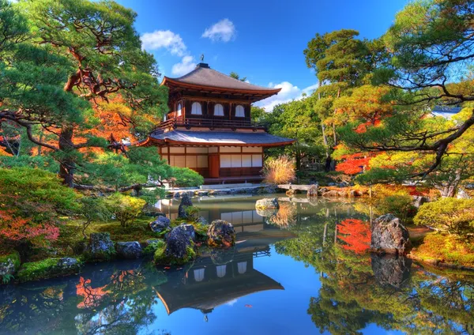

# Интересные факты о Японии

1. В состав Японии входит более **6 800 островов**. Самые крупные из них – это Хоккайдо, Хонсю, Сикоку и Кюсю.
2. В Японии живет более **50 тыс. человек, которые уже отметили 100-летний юбилей**. В стране самый высокий уровень продолжительности жизни в мире – 83,7 года.
3. В Японии курсируют одни из самых **пунктуальных поездов** в мире. Их отклонение от графика обычно не превышает 18 секунд. При этом поезд на магнитной подушке (*маглев*) способен **развивать скорость до 603 км/ч**. Это абсолютный рекорд. 

4. Ежегодно в Японии случается **около 1,5 тысячи землетрясений**. Одно из самых разрушительных за всю историю страны произошло в марте 2011 года. Оно вызвало цунами, которое унесло жизни 15 869 человек.

5. В Японии больше домашних животных, чем детей. **Количество пушистых любимцев достигло 19,8 млн особей**, в то время как детей, по подсчетам демографов, в стране около 15,9 млн.